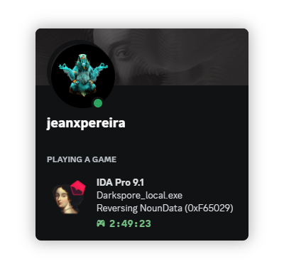

<h1 align="center">Discord Rich Presence Visualizer</h1>

## Features

- Create realistic Discord Rich Presence cards with customizable elements
- Accurate Discord UI styling with proper GG Sans font family
- Export your design as a PNG image with one click
- No dependencies beyond vanilla HTML, CSS, and JavaScript
- Uses the DOM-to-Image library for high-quality exports

## How It Works

The Discord Rich Presence Visualizer creates a pixel-perfect replica of Discord's activity card UI. The current implementation includes:

- Profile avatar with online status indicator
- Custom banner header
- Username display
- Game activity section with icon
- Game title, details and current state
- Elapsed gaming time with custom icon

Once you've set up your desired Rich Presence look, simply click the "Download as PNG" button to export your design.

## Usage

1. Open `DiscordRichViewer.html` in your web browser
2. Customize the Rich Presence card by modifying the HTML or CSS
3. Click the "Download as PNG" button
4. Use your exported image for showcasing, documentation, or mockups

## Customization

To customize the Rich Presence card, you can modify the following elements in the HTML:

- Banner image (`.header-banner` background-image)
- Avatar image (`.profile-avatar` src attribute)
- Username (`.username` content)
- Game icon (`.game-icon` src attribute)
- Game title (`.game-title` content)
- Game detail (`.game-detail` content)
- Game state (`.game-state` content)
- Play time (`.playtime-text` content)

## Technical Details

- Uses DOM-to-Image for converting HTML elements to PNG
- Implements Discord's GG Sans font family for authenticity
- Responsive design elements to match Discord's UI
- Vanilla JavaScript with no framework dependencies

## Requirements

- Modern web browser with JavaScript enabled
- Internet connection (for loading the CDN-hosted DOM-to-Image library)

## Future Improvements

- Add form-based customization interface
- Support for custom themes and color schemes
- Additional Rich Presence templates (Spotify, custom status, etc.)
- Live preview mode

## Credits

- Discord for the UI design inspiration
- [DOM-to-Image](https://github.com/tsayen/dom-to-image) library for HTML-to-PNG conversion